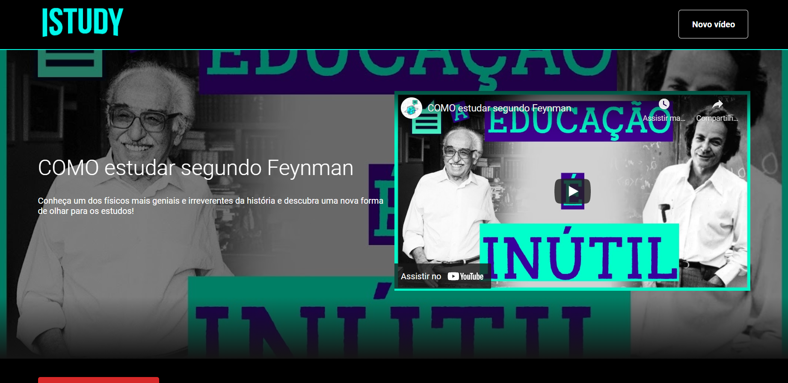
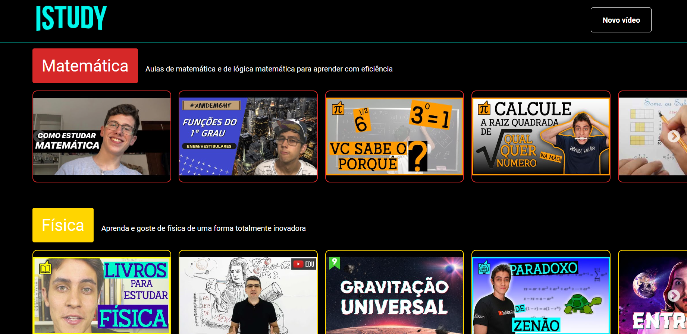
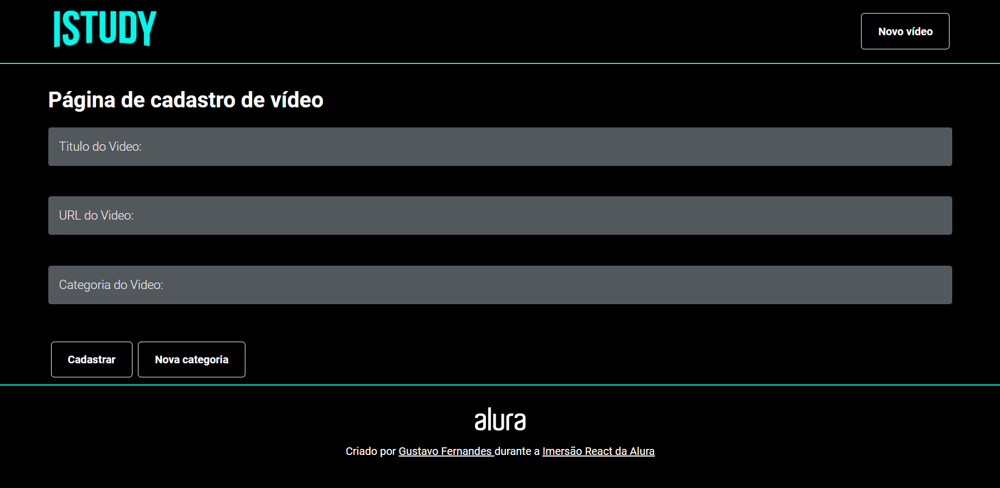
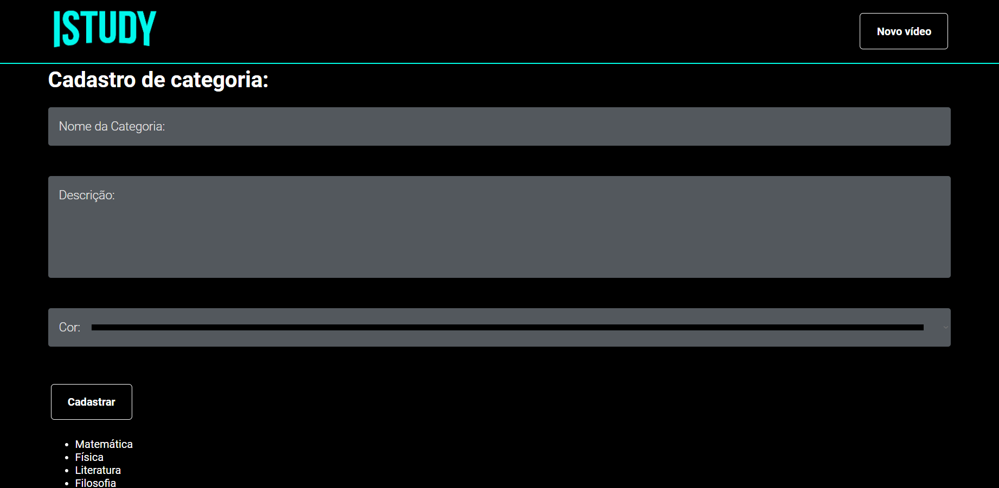

<h1 align = "center">📚 Istudy 📚</h1>

<h1 align = "center">

</h1>

## 📲 Sobre

O Istudy é um website criado através da biblioteca React junto ao evento Imersão React da Alura de 2020, onde fiz uma listagem de algumas aulas de matérias específicas do ensino médio e ensinamentos importantes nos quais tive contato pelo YouTube nos últimos anos e que me ajudaram nos estudos.

## 📋 Tabela de conteúdo

   * [Sobre](https://github.com/gust-f/Istudy#-sobre)
   * [Tabela de Conteúdo](https://github.com/gust-f/Istudy#-tabela-de-conte%C3%BAdo)
   * [Funções](https://github.com/gust-f/Istudy#-fun%C3%A7%C3%B5es)
   * [Pré-requisitos e instalação]()
   * [Como usar](https://github.com/gust-f/Istudy#-como-usar)
     * [Acessando os videos](https://github.com/gust-f/Istudy#acessando-os-videos)
     * [Cadastrando novo video](https://github.com/gust-f/Istudy#cadastrando-novo-video)
     * [Cadastrando categoria](https://github.com/gust-f/Istudy#cadastrando-categoria)
   * [Tecnologias](https://github.com/gust-f/Istudy#-tecnologias)

<h1 align="center"> 
	🚧 Projeto concluído 🚧
</h1>

## 🧠 Funções

- [x] Acesso aos videos pelo YouTube
- [x] Cadastro de novos videos
- [x] Cadastro de novas categorias

<h1 align = "center">🔑 Acesse o site <a href = "https://istudy.vercel.app">aqui</a></h1>

## 👨‍💻 Como usar

### Acessando os videos

Logo ao acessar o site através do link da Vercel, vemos a página inicial, onde está incluso um vídeo destaque no começo como aparece inicialmente no README, e outros videos separados por categorias (Matemática, física, literatura, filosofia e inglês), tudo ao melhor estilo Netflix.

<h1 align = "center">

</h1>

### Cadastrando novo video

Ao clicar no botão superior direito da página, somos direcionados a página para adicionar novos videos, onde escolhemos um título, botamos a URL do vídeo e escolhemos a categoria na qual o video se encaixa.

<h1 align = "center">

</h1>

### Cadastrando categoria

Ainda na página de cadastro de video, tem um botão que redireciona a página ao cadastro de categorias, onde você pode adicionar novas categorias e escolher uma cor para elas.

<h1 align = "center">

</h1>

## 🔧 Tecnologias

- [React](https://pt-br.reactjs.org/)
- [Heroku](https://www.heroku.com/what)
- [Vercel](https://vercel.com/docs)

## ✍️ Autor

<h3 align = "center">
⚛️ Criado por <a href = "https://github.com/gust-f">Gustavo Fernandes</a> durante a <a href = "https://www.alura.com.br">Imersão React da Alura 
⚛️</a></h3>
